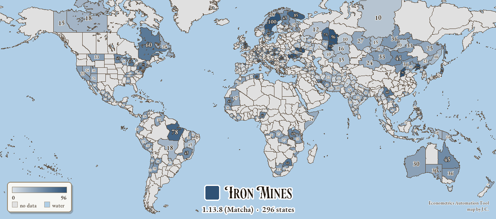
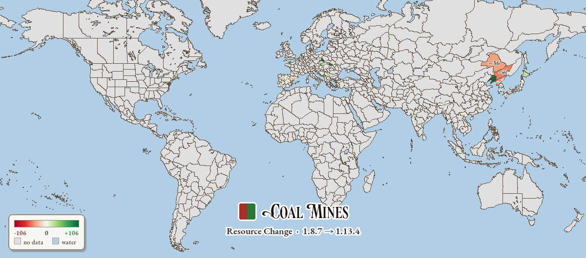
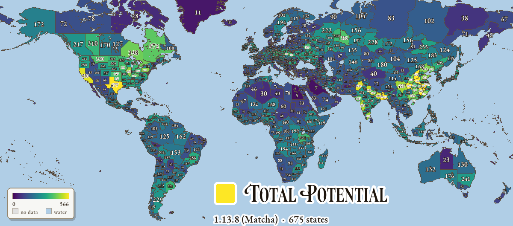
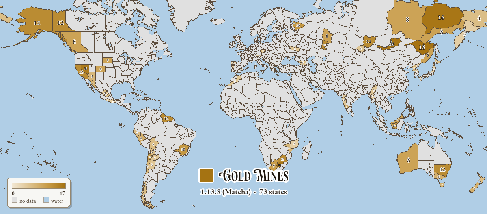
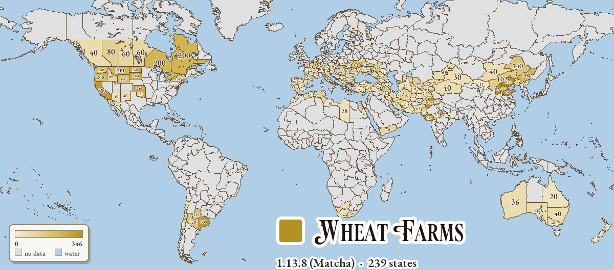

# EAT — Victoria 3 Econometrics Automation

[中文](README.md) | **English**

Econometrics Automation, the EAT tool, is a fully automated pipeline for V3 econometric research. It does not modify game content in any way; on the contrary, it extracts data from local files for tabular archiving, data visualization, and map rendering.

### Why this tool?

Victoria 3's economic decision space spans ~440 production methods (PMs), ~200 production method groups (PMGs), and ~110 buildings, yielding 1500+ theoretical combinations. Any analysis based on hand-copied tables goes stale after every patch — you never know what Paradox quietly tweaked (or maybe they wrote it down somewhere, but you've been away from V3 for a while). This causes pain for maintainers and forces players to wrestle with outdated guides.

EAT solves this with end-to-end V3 economic analysis:

- One command: export an Excel sheet with all 1500+ combinations for the **current version**
- One command: diff **two reports** to see exactly which buildings and which fields changed
- The report auto-embeds the game version (e.g. `1.13.4 (Matcha)`) for easy archival
- Intuitive data visualization and map rendering


## Installation

### Step 1: Unzip anywhere

Put the `V3_EAT` folder wherever you like (**no longer required to be inside the game folder** — that risked Steam's "verify integrity" wiping it). Typical locations: `D:\tools\V3_EAT\` or `C:\Users\you\Documents\V3_EAT\`.

### Step 2: Install Python and dependencies

Requires Python ≥ 3.10. Open PowerShell in the V3_EAT folder and install everything at once:

```powershell
python -m pip install -r requirements.txt
```

What each is for: `openpyxl` (Excel reports — all features), `pillow` + `numpy` (Feature 2's map rendering), `scipy` (thicken map national borders — optional, degrades gracefully). If you only want the tables, `pip install openpyxl` is enough.

### Step 3: First run — locating the game

The tool auto-resolves the V3 install in this order:

1. CLI flag `--game-root <path>` (one-shot override)
2. Environment variable `V3_GAME_ROOT`
3. Cache file `<V3_EAT>/.game_root`
4. **Steam library scan** (Windows registry + `libraryfolders.vdf`) — **handles most users**
5. If V3_EAT happens to live inside the game directory, walk up to find it

Most users need no configuration. If detection fails, pick any of:

```powershell
python -m v3_eat config --game-root "D:\Games\Victoria 3"   # persisted
python -m v3_eat report --game-root "D:\Games\Victoria 3"    # one-shot
$env:V3_GAME_ROOT = "D:\Games\Victoria 3"; python -m v3_eat report  # env var
```

Helpers:

```powershell
python -m v3_eat config --show     # show cached path + currently resolved path
python -m v3_eat config --clear    # clear cache; next run re-detects
```


## Usage

### Feature 1: Buildings Profit Report

```powershell
# Generate for the current version (Chinese UI by default)
python -m v3_eat report

# Cross-version comparison — a 1.13.4 baseline ships with the project, use it directly
python -m v3_eat report --out current.xlsx
python -m v3_eat diff baseline_buildings_v1.13.4.xlsx current.xlsx

# Switch language (all 11 V3 localizations)
python -m v3_eat report --lang english   --out v3_eat_report_en.xlsx
python -m v3_eat report --lang french    --out v3_eat_report_fr.xlsx
python -m v3_eat report --lang german    --out v3_eat_report_gm.xlsx
python -m v3_eat report --lang japanese  --out v3_eat_report_jp.xlsx
python -m v3_eat report --lang korean    --out v3_eat_report_kr.xlsx
python -m v3_eat report --lang polish    --out v3_eat_report_po.xlsx
python -m v3_eat report --lang russian   --out v3_eat_report_ru.xlsx
python -m v3_eat report --lang spanish   --out v3_eat_report_sp.xlsx
python -m v3_eat report --lang turkish   --out v3_eat_report_tu.xlsx
python -m v3_eat report --lang braz_por  --out v3_eat_report_bp.xlsx
```

Output location: `V3_EAT\out\buildings\{reports,diffs}\`.

The report has 12 sheets: Info / Overview / Agriculture / Plantations / Extraction / Manufacturing / Service / Infrastructure / Government / Military / Monuments / Construction Sectors. Each row's core fields: Building / Base-Secondary-Automation PM / Output Value / Input Value / Profit / Construction / Employment / Wage Multiplier / Construction ROI / Annual Per-Capita Profit. The diff workbook has 6 sheets (Added-Combo / Removed-Combo / Changed-Combo and the construction-sector counterparts); changed metric columns appear as `Old / New / Δ` triples with auto green/red coloring on Δ.

### Feature 2: State-Region Resources (Table & Maps)

Regional resources come in two forms: a **statistics table** (Excel) and **map visualization** (PNG/SVG/interactive HTML) — the latter is a natural extension of the former, painting the same data onto the game map.

#### 2a · Resource statistics table

```powershell
# Generate for the current version (Chinese UI by default)
python -m v3_eat regions report

# Cross-version comparison — a 1.13.4 baseline ships with the project, use it directly
python -m v3_eat regions report --out current.xlsx
python -m v3_eat regions diff baseline_regions_v1.13.4.xlsx current.xlsx

# Switch language
python -m v3_eat regions report --lang english   --out regions_en.xlsx
python -m v3_eat regions report --lang french    --out regions_fr.xlsx
python -m v3_eat regions report --lang german    --out regions_gm.xlsx
python -m v3_eat regions report --lang japanese  --out regions_jp.xlsx
python -m v3_eat regions report --lang korean    --out regions_kr.xlsx
python -m v3_eat regions report --lang polish    --out regions_po.xlsx
python -m v3_eat regions report --lang russian   --out regions_ru.xlsx
python -m v3_eat regions report --lang spanish   --out regions_sp.xlsx
python -m v3_eat regions report --lang turkish   --out regions_tu.xlsx
python -m v3_eat regions report --lang braz_por  --out regions_bp.xlsx
```

Output location: `V3_EAT\out\regions\{reports,diffs}\`.

The report buckets states into 14 continent groups (Western Europe / Southern Europe / Northern Europe / Eastern Europe / North America / Central America / South America / Africa / Middle East / Central Asia / India / East Asia / Southeast Asia / Oceania). **Row 2 is a totals row** (sum of all states' resources within the bucket). Each row's core fields: State / Strategic Region / Arable Land / Arable Buildings / Capped Total / **per-resource columns** (Iron Mine / Coal Mine / Logging Camp / Oil Rig / etc., easy to sort & compare) / Total Capacity / State Traits.

#### 2b · Resource map (visualization)

Recolor **the game's own world map** by the numbers from the table — shade depth = resource amount — with the value printed at each state's centre. The technique is the standard Paradox "indexed province color → lookup-table recolor". Colors and fonts come from the game's own assets (Victorian style); images render in English.

| Resource choropleth (iron · auto colour + labels + legend) | Cross-version change map (red = cut, green = grew) |
| --- | --- |
|  |  |
| **Total potential + 1836 national borders** (micro-states skipped) | **Gold** (gold fields merged in, amber palette) |
|  |  |
| **Wheat distribution** (`--crops` map, shaded by arable land) | |
|  | |

```powershell
# Default: a "total potential" PNG + an interactive HTML viewer (values labeled on tiles)
python -m v3_eat regions map

# A single layer (any resource building id or aggregate); auto per-resource color by default
python -m v3_eat regions map --metric building_iron_mine     # iron → steel blue
python -m v3_eat regions map --all --svg                     # all 14 layers, each with a vector SVG
python -m v3_eat regions map --crops                         # 16 crop-distribution maps → maps/crops/

# National borders / high-res / vector
python -m v3_eat regions map --metric total_capacity --countries                              # overlay 1836 borders (drops tribes)
python -m v3_eat regions map --metric total_capacity --countries --country-filter recognized  # great-power-recognized only
python -m v3_eat regions map --metric building_iron_mine --full-res                           # native 8192px

# Cross-version change map (red down / green up; reuses two Feature-2 reports)
python -m v3_eat regions map-diff baseline_regions_v1.8.7.xlsx baseline_regions_v1.13.4.xlsx --metric building_coal_mine

# Multi-version timeline viewer (version slider + Δ-change)
python -m v3_eat regions map-timeline baseline_regions_v1.8.7.xlsx baseline_regions_v1.13.4.xlsx

# Embed the maps straight into the Excel report above (adds a "Resource Maps" sheet)
python -m v3_eat regions report --maps
```

Output: `out/regions/maps/` (gallery PNG/SVG + interactive HTML; `diffs/` change maps, `national/` border versions, `atlas/` Excel sources, `showcase/` high-res · borders).

> **Regenerate every example at once**: all the commands/options above are bundled into a script that buckets its output into subfolders —
> ```bash
> bash scripts/gen_maps.sh
> ```
> On Windows run it from Git Bash (the commands are plain `python -m v3_eat …`, so PowerShell users can copy them one by one too). Optional `PYTHON=py` / `GAME_ROOT="D:/Games/Victoria 3"` overrides. Outputs land in `out/` (git-ignored, local only).

- **PNG**: `map_<metric>.png`, with a bottom-centre **artistic legend** (resource colour-chip + large title — identifiable even as a thumbnail), a value at each state's centre, and outlined borders; fonts from the game's ParadoxVictorian / Playfair / EB Garamond.
- **Interactive HTML**: `resource_map.html` — single file, open in a browser: dropdowns for the 14 layers and colormap, continent zoom, state search, label toggle, hover for "state + value".
- **Vector SVG** (`--svg`, combine with `--all`): high-res raster fill + vector labels/legend with the **game fonts embedded**, crisp at any zoom/print.
- **National borders** (`--countries`): `--country-filter civilized` (default, drops tribal/decentralized polities but keeps China/Japan/Persia) / `recognized` (great-power-recognized only) / `all`; `--min-country-provinces N` (default 8) trims by size.
- **Crop distribution** (`--crops`): from each state's `arable_resources`, 16 crop maps (wheat/rice/cotton/tobacco/vineyard/sugar/coffee/tea/silk/dye/opium…) showing the crop's growable range shaded by arable land, into `maps/crops/`; the interactive HTML also includes these crop layers (30 total).
- **Colormaps** (`--cmap`): `auto` (default) gives each resource/crop a mnemonic hue (coal=charcoal, iron=steel-blue, gold=amber …; wheat=golden, rice=paddy-green, cotton=grey-tan …), light→dark = few→many; or force `viridis`/`magma`/single-hue `blues`/`greens`/… . `--gamma` (default 0.7) boosts depth contrast.

### Feature 3: Pop-Growth & Workforce-Ratio Analysis

```powershell
# Bilingual HTML reports + CSV raw data (default)
python -m v3_eat demography report

# English only
python -m v3_eat demography report --ui-lang en
# Chinese only
python -m v3_eat demography report --ui-lang zh

# Custom projection (default: 100 years, SoL 15, 25% → 50% workforce ratio)
python -m v3_eat demography report --months 600 --projection-sol 12 \
    --initial-workforce-ratio 0.20 --projection-target 0.45

# Linear SoL trajectory from 8 to 14 across the projection window
python -m v3_eat demography report --sol-start 8 --sol-end 14

# Skip the slow scan of game/common (faster, but the modifier-source CSV and
# the modifier-frequency bar chart in the HTML are then empty)
python -m v3_eat demography report --skip-modifier-scan

# Disable the WORKING_ADULT_RATIO_SKEW_MAXIMUM correction (legacy uniform model)
python -m v3_eat demography report --no-skew
```

Output location: `V3_EAT\out\demography\`.

Per run (default `--ui-lang both`):

- `demography_report_{en,zh}.html` — single merged report: academic-style analysis narrative (base curves, sensitivities, controlled healthcare comparison, method limits) plus all charts, scenario tables, and the data dictionary inline
- `rates_by_sol.csv` — birth / mortality / net growth by SoL × scenario
- `net_growth_sensitivity.csv` — one-factor-at-a-time net-growth sensitivities
- `workforce_projection.csv` — 100-year workforce-ratio and population trajectories per scenario
- `workforce_sensitivity.csv` — same projection isolated per factor
- `modifier_sources.csv` / `modifier_source_summary.csv` — scan of every relevant modifier hit in `game/common`
- `pollution_impact_examples.csv` — steady-state pollution generation → impact reference
- `pollution_dynamics.csv` — monthly transient pollution build-up

The report is driven by the population curves in `defines/00_defines.txt`, the health-system laws in `laws/00_health_system.txt`, the women's-rights laws in `laws/00_rights_of_women.txt`, and the literacy / starvation static modifiers in `static_modifiers/00_code_static_modifiers.txt`. Law / health / starvation values are parsed live from `game/common` by default (`--scenarios-from game`), so any stale hardcoded value would be overridden; pass `--scenarios-from hardcoded` to use the constants frozen in `v3_eat/demography/scenarios.py`.

### Utility Commands

```powershell
python -m v3_eat verify                       # self-check (parses current game data correctly)
python -m v3_eat dump-pm pm_simple_farming    # debug a single PM's parsed result
python tests\test_diff.py                     # run tests (expect 6 PASS lines)
```

Common args: `--game-root <path>` overrides the game root; `--ui-lang zh|en` forces a UI language (default: inferred from `--lang` — `simp_chinese` → Chinese UI, everything else → English).

**Cross-version baselines**: the project ships `baselines/baseline_{buildings,regions}_v{1.0.6,1.3.6,1.6.2,1.9.8,1.13.8}.xlsx`, ready for `diff` / `regions diff` / `regions map-diff`. To baseline another version, switch to it in Steam (Properties → Betas), let it download, then run — the script **auto-names by the installed version**:

```bash
bash scripts/make_baseline.sh        # writes baselines/baseline_{buildings,regions}_v<current>.xlsx
```

---

## Further Documentation

- **V3 economic mechanics + the tool's simplifying assumptions**: [docs/economics.en.md](docs/economics.en.md)
- **Architecture, modules, output schema, diff implementation details**: [docs/method.en.md](docs/method.en.md)


## Data Sources

| Content              | File                                                         |
| -------------------- | ------------------------------------------------------------ |
| Game version         | `launcher/launcher-settings.json`                            |
| Goods prices / pop wages | `common/{goods,pop_types}/*.txt`                         |
| PMs / PMGs / buildings | `common/{production_methods,production_method_groups,buildings}/*.txt` |
| Building-group parent chain | `common/building_groups/00_building_groups.txt`       |
| Construction tiers   | `common/script_values/building_values.txt`                   |
| Localizations        | `localization/{lang}/*.yml`                                  |
