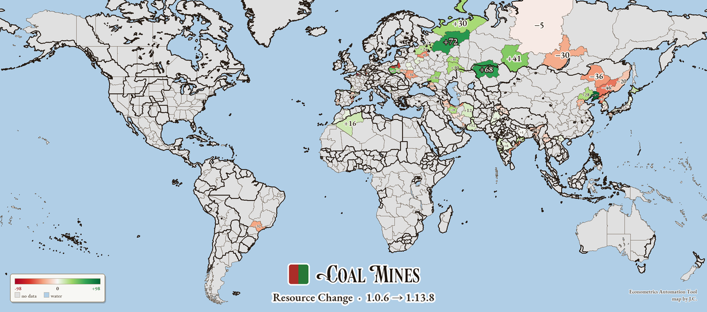

# EAT — Victoria 3 计量经济自动化工具

**中文** | [English](README.en.md)

Econometrics Automation Tool，即EAT模组，是一套V3计量经济学研究的全自动管线工具。它并不涉及游戏内容的任何修改，而是从本地文件提取数据，进行表格归档、可视化、地图绘制等工作。

| 资源等值图（铁矿 · 自动配色 + 标注 + 图例）                  | 跨版本资源变化图（红=削减，绿=增加）                         |
| ------------------------------------------------------------ | ------------------------------------------------------------ |
|  |  |
| **总潜能 + 1836 国界**（自动跳过部落小国）                   | **金矿**（已合并金矿场，琥珀配色）                           |
|  |  |
| **小麦分布**（`--crops` 农作物图，按可耕地深浅）             |                                                              |
|  |                                                              |

### 为什么做这个模组？

Victoria 3 中的经济决策空间由 ~440 种生产方式（PM）、~200 个生产方式组（PMG）、~110 座建筑构成，理论组合空间 1500 余种。任何依赖人工抄表的经济分析都容易在每次补丁后陈旧，毕竟你永远不知道P社究竟暗改了什么（或者他们写在了某次日志里，但你已经很久没玩V3了），这一方面给维护者带来了痛苦，另一方面也使得玩家不可避免地遭受过时攻略的困扰。

EAT可以方便快捷地实现端到端的V3经济分析，从而解决上述问题：

- 一行命令，**当前版本**全部 1500+ 组合的经济指标导出 Excel
- 一行命令，**两个版本**的报表做差分，精确告诉玩家哪些建筑、哪些字段被改了多少
- 报告自动嵌入游戏版本号（如 `1.13.8 (Matcha)`），便于历史归档
- 方便直观的数据可视化和地图绘制


## 安装

### 第一步：解压到任意位置

把 `V3_EAT` 文件夹放在你喜欢的任何地方都可以（**不必再放进游戏目录**，避免被 Steam 校验文件时误删）。常见的位置如 `D:\tools\V3_EAT\` 或 `C:\Users\你\Documents\V3_EAT\`。

### 第二步：装 Python 与依赖

需要 Python ≥ 3.10。在 V3_EAT 目录打开 PowerShell，一键装齐全部依赖：

```powershell
python -m pip install -r requirements.txt
```

各依赖用途：`openpyxl`（所有功能的 Excel 报表）、`pillow` + `numpy`（功能 2 的地图渲染）、`scipy`（地图国界加粗，可选，缺失自动降级）。只用表格、不画地图的话，`pip install openpyxl` 即可。


### 第三步：首次运行 —— 找到游戏

工具默认按以下顺序自动找到 V3 安装位置：

1. CLI 参数 `--game-root <path>`（一次性覆盖）
2. 环境变量 `V3_GAME_ROOT`
3. 缓存文件 `<V3_EAT>/.game_root`
4. **自动扫描 Steam 库**（Windows 注册表 + `libraryfolders.vdf`）—— **多数用户到这一步即可**
5. 如果 V3_EAT 自己就在游戏目录下，向上回溯找到游戏根

绝大多数情况下你不需要做任何配置。如果自动检测失败，三种解决方式任选其一：

```powershell
python -m v3_eat config --game-root "E:\STEAM\steamapps\common\Victoria 3"   # 持久化保存
python -m v3_eat report --game-root "E:\STEAM\steamapps\common\Victoria 3"    # 单次覆盖
$env:V3_GAME_ROOT = "E:\STEAM\steamapps\common\Victoria 3"; python -m v3_eat report  # 环境变量
```

辅助命令：

```powershell
python -m v3_eat config --show     # 查看当前缓存的路径与实际解析路径
python -m v3_eat config --clear    # 清缓存，下次重新检测
```


## 使用

### 功能 1：建筑产值表

```powershell
# 生成当前版本（默认中文）
python -m v3_eat report

# 跨版本对比 —— 项目内置多种基线，可直接用
python -m v3_eat report --out current.xlsx
python -m v3_eat diff baseline_buildings_v1.13.8.xlsx current.xlsx

# 切换语言（V3 全部 11 种）
python -m v3_eat report --lang english   --out v3_eat_report_en.xlsx
python -m v3_eat report --lang french    --out v3_eat_report_fr.xlsx
python -m v3_eat report --lang german    --out v3_eat_report_gm.xlsx
python -m v3_eat report --lang japanese  --out v3_eat_report_jp.xlsx
python -m v3_eat report --lang korean    --out v3_eat_report_kr.xlsx
python -m v3_eat report --lang polish    --out v3_eat_report_po.xlsx
python -m v3_eat report --lang russian   --out v3_eat_report_ru.xlsx
python -m v3_eat report --lang spanish   --out v3_eat_report_sp.xlsx
python -m v3_eat report --lang turkish   --out v3_eat_report_tu.xlsx
python -m v3_eat report --lang braz_por  --out v3_eat_report_bp.xlsx
```

输出位置：`V3_EAT\out\buildings\{reports,diffs}\`。

报表包含 12 张 sheet：信息 / 总览 / 农业 / 种植园 / 开采业 / 制造业 / 服务业 / 基础设施 / 政府 / 军政 / 纪念物 / 建造部门。每行核心字段：建筑 / 基础-次要-自动化生产方式 / 产出价值 / 投入价值 / 利润 / 建造力 / 劳动力 / 工资倍率 / 建造力回报率 / 人均年产值。Diff 工作簿含「新增-组合 / 移除-组合 / 变更-组合」等 6 张 sheet，变更字段以「旧 / 新 / Δ」三列并排，Δ 自动绿/红着色。

### 功能 2：地区资源统计与可视化

地区资源有两种呈现：**统计表**（Excel）与**地图可视化**（PNG/SVG/交互 HTML）——后者是前者的自然延伸，把同一份数据画到游戏地图上。

#### 2a · 资源统计表

```powershell
# 生成当前版本（默认中文）
python -m v3_eat regions report

# 跨版本对比 —— 项目内置多种基线，可直接用
python -m v3_eat regions report --out current.xlsx
python -m v3_eat regions diff baseline_regions_v1.13.8.xlsx current.xlsx

# 切换语言
python -m v3_eat regions report --lang english   --out regions_en.xlsx
python -m v3_eat regions report --lang french    --out regions_fr.xlsx
python -m v3_eat regions report --lang german    --out regions_gm.xlsx
python -m v3_eat regions report --lang japanese  --out regions_jp.xlsx
python -m v3_eat regions report --lang korean    --out regions_kr.xlsx
python -m v3_eat regions report --lang polish    --out regions_po.xlsx
python -m v3_eat regions report --lang russian   --out regions_ru.xlsx
python -m v3_eat regions report --lang spanish   --out regions_sp.xlsx
python -m v3_eat regions report --lang turkish   --out regions_tu.xlsx
python -m v3_eat regions report --lang braz_por  --out regions_bp.xlsx
```

输出位置：`V3_EAT\out\regions\{reports,diffs}\`。

报表按 14 个大洲分桶（西欧 / 南欧 / 北欧 / 东欧 / 北美 / 中美 / 南美 / 非洲 / 中东 / 中亚 / 印度 / 东亚 / 东南亚 / 大洋洲）。**首行是合计**（该桶内全部地区资源总和）。每行核心字段：地区 / 战略大区 / 可耕地 / 可耕作建筑 / 上限总和 / **每种资源的单项列**（铁矿/煤矿/林业营地/油田 等，方便排序对比）/ 总产能容量 / 地区特性。

#### 2b · 地区资源地图（可视化）

把统计表里的每个数字**重新着色到游戏自带的世界地图上**，深浅表示资源数目，并在每块地的几何中心**直接标注数值**。技法是 Paradox 社区通用的「省份索引色 → 查找表重着色」。配色、字体取自游戏自带资源（维多利亚风格），图片输出统一为英文。

```powershell
# 默认：画「总潜能」PNG + 交互式 HTML（深浅 = 资源量，地块标数值）
python -m v3_eat regions map

# 单个图层（任一资源建筑 id 或聚合量），默认按资源种类自动配色
python -m v3_eat regions map --metric building_iron_mine     # 铁矿 → 钢蓝
python -m v3_eat regions map --all --svg                     # 全部 14 图层，各配一份矢量 SVG
python -m v3_eat regions map --crops                         # 16 种农作物分布图 → maps/crops/

# 国界 / 高清 / 矢量
python -m v3_eat regions map --metric total_capacity --countries                              # 叠 1836 国界（默认丢部落小国）
python -m v3_eat regions map --metric total_capacity --countries --country-filter recognized  # 只描列强承认国
python -m v3_eat regions map --metric building_iron_mine --full-res                           # 原生 8192px

# 跨版本变化图（红减绿增，复用功能 2 的两份报表，内置基线开箱即用）
python -m v3_eat regions map-diff baseline_regions_v1.9.8.xlsx baseline_regions_v1.13.8.xlsx --metric building_coal_mine

# 多版本时间线交互图（版本滑块 + Δ变化）
python -m v3_eat regions map-timeline baseline_regions_v1.9.8.xlsx baseline_regions_v1.13.8.xlsx

# 把资源地图直接嵌进上面的 Excel 报表（新增「资源地图」工作表）
python -m v3_eat regions report --maps
```

输出位置：`out/regions/maps/`（图集 PNG/SVG + 交互 HTML；`diffs/` 变化图、`national/` 国界版、`atlas/` Excel 素材、`showcase/` 高清·国界）。

> **一键重生全部示例图**：上面所有命令与参数已打包成脚本，分桶输出到子目录——
> ```bash
> bash scripts/gen_maps.sh
> ```
> Windows 用 Git Bash 运行（命令都是 `python -m v3_eat …`，PowerShell 用户也可逐条复制）。可选 `PYTHON=py`、`GAME_ROOT="D:/Games/Victoria 3"` 覆盖。产物在 `out/`（git 忽略，仅本地查看）。

- **PNG**：`map_<metric>.png`，中下方**艺术图例**（资源色块 + 大标题，缩略图也能一眼分辨是哪种资源），每块地标数值、描州界；字体取自游戏 ParadoxVictorian / Playfair / EB Garamond。
- **交互式 HTML**：`resource_map.html` —— 单文件，浏览器打开即用：下拉切 14 图层、切配色、按大洲缩放、搜地区名、开关数值标注、悬停看「州名 + 数值」。
- **矢量 SVG**（`--svg`，可配 `--all`）：高清栅格底图 + 矢量数值/图例，**内嵌游戏字体**（与 PNG 一致），缩放打印不糊。
- **国界**（`--countries`）：`--country-filter civilized`（默认，丢部落/分散政权但保留中日波斯）/ `recognized`（仅列强承认国）/ `all`；`--min-country-provinces N`（默认 8）按规模再过滤。
- **农作物分布**（`--crops`）：据各州 `arable_resources` 出 16 种作物图（小麦/水稻/棉花/烟草/葡萄/甘蔗/咖啡/茶/丝/染料/罂粟…），显示可种植范围并按可耕地深浅着色，输出到 `maps/crops/`；交互 HTML 也含这些作物图层（共 30 层）。
- **配色**（`--cmap`）：`auto`（默认）每种资源/作物各取助记色相（煤=炭黑、铁=钢蓝、硫=黄、金=琥珀、油=茄紫、伐木=森绿…；小麦=金、水稻=稻绿、棉花=灰褐…），浅→深 = 少→多；也可强制 `viridis`/`magma`/`plasma`/`inferno` 或单色 `blues`/`greens`/… 。`--gamma`（默认 0.7）增强深浅区分，`--labels/--no-labels`、`--clip`、`--log-scale` 微调。

### 功能 3：人口与劳动力比例分析

```powershell
# 生成中英双语 HTML 报告 + CSV 原始数据（默认）
python -m v3_eat demography report

# 只出英文
python -m v3_eat demography report --ui-lang en
# 只出中文
python -m v3_eat demography report --ui-lang zh

# 自定义投影窗口（默认 100 年、SoL 15、25% → 50% 劳动力比例）
python -m v3_eat demography report --months 600 --projection-sol 12 \
    --initial-workforce-ratio 0.20 --projection-target 0.45

# 让 SoL 在 100 年里从 8 线性涨到 14
python -m v3_eat demography report --sol-start 8 --sol-end 14

# 跳过对 game/common 的全量扫描（更快，但会丢失 modifier_sources.csv 与图表里的修正频次）
python -m v3_eat demography report --skip-modifier-scan

# 关闭 WORKING_ADULT_RATIO_SKEW_MAXIMUM 偏移模型，回到旧的均匀死亡分摊
python -m v3_eat demography report --no-skew
```

输出位置：`V3_EAT\out\demography\`。

每次运行产出（默认 `--ui-lang both`）：

- `demography_report_{en,zh}.html` — 单文件合并报告：学术风格分析正文（基础曲线、敏感性、医疗对比、方法局限）与全部图表、场景表、数据字典内联同一文档
- `rates_by_sol.csv` — 按 SoL × 场景的出生率/死亡率/自然增长
- `net_growth_sensitivity.csv` — 按因素分组的自然增长敏感性
- `workforce_projection.csv` — 各场景 100 年劳动力比例与人口曲线
- `workforce_sensitivity.csv` — 各因素隔离投影
- `modifier_sources.csv` / `modifier_source_summary.csv` — 全 `game/common` 的相关修正扫描
- `pollution_impact_examples.csv` — 污染生成 → impact 的稳态对照
- `pollution_dynamics.csv` — 污染瞬态月度演化

报告基于游戏 `defines/00_defines.txt` 中的人口曲线、`laws/00_health_system.txt` 的医疗法律、`laws/00_rights_of_women.txt` 的女权法律、`static_modifiers/00_code_static_modifiers.txt` 的识字率与饥荒静态修正等。法律 / 医疗 / 饥荒数值默认从 `game/common` 实时解析（`--scenarios-from game`），过期的硬编码值会被自动覆盖；`--scenarios-from hardcoded` 退回到 `v3_eat/demography/scenarios.py` 内的常量。

### 工具命令

```powershell
python -m v3_eat verify                       # 自检（确认能正确解析当前游戏）
python -m v3_eat dump-pm pm_simple_farming    # 调试单个生产方式的解析结果
python tests\test_diff.py                     # 跑测例（应有 6 个 PASS）
```

通用参数：`--game-root <path>` 指定别的游戏根目录；`--ui-lang zh|en` 强制 UI 语言（默认根据 `--lang` 推断：simp_chinese → 中文 UI，其余 → 英文）。

**跨版本基线**：项目内置 `baselines/baseline_{buildings,regions}_v{1.0.6,1.3.6,1.6.2,1.9.8,1.13.8}.xlsx`，可直接用于 `diff` / `regions diff` / `regions map-diff`。想给别的版本做基线：在 Steam 切到该版本（属性 → 测试版）下载完，再运行——脚本会**按当前安装的版本号自动命名**：

```bash
bash scripts/make_baseline.sh        # 写出 baselines/baseline_{buildings,regions}_v<当前版本>.xlsx
```

---

## 进阶文档

- **V3 经济运行原理 + 工具的简化假设**：[docs/economics.md](docs/economics.md)
- **架构、模块、输出 schema、diff 实现细节**：[docs/method.md](docs/method.md)


## 数据来源

| 内容                 | 文件                                                         |
| -------------------- | ------------------------------------------------------------ |
| 游戏版本             | `launcher/launcher-settings.json`                            |
| 商品价格 / 工种工资  | `common/{goods,pop_types}/*.txt`                             |
| 生产方式 / 组 / 建筑 | `common/{production_methods,production_method_groups,buildings}/*.txt` |
| 建筑组父链           | `common/building_groups/00_building_groups.txt`              |
| 建造档位             | `common/script_values/building_values.txt`                   |
| 本地化               | `localization/{lang}/*.yml`                                  |
